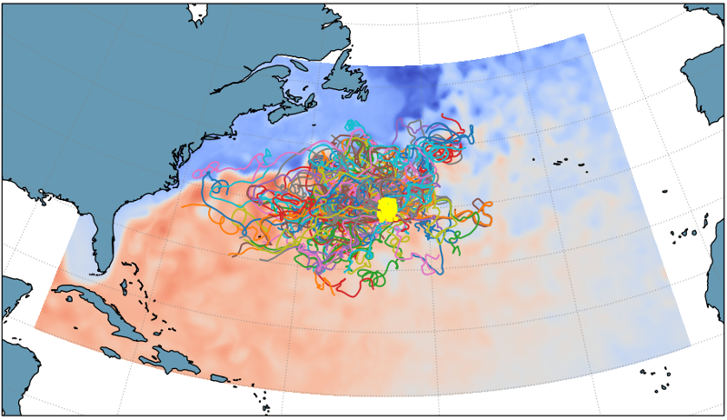
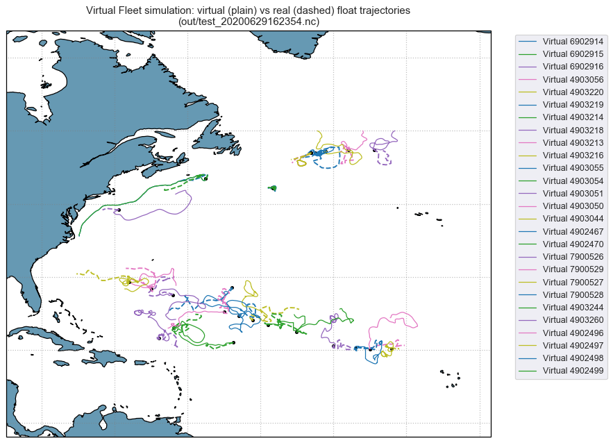

# Simulation examples

## Gulf Stream, Example 1

10 floats advected (initial positions in yellow dots) for 1 years, dt = 5 minutes.  

**Dataset** : 
- GulfStream subset of the Operational Mercator daily ocean analysis and forecast system at 1/12 degree.  
  
**Run** : 
- 2 cores in use  
- 36 Gb of memory in use   
- Runtime = 00:05:30 
 

## Gulf Stream, Example 2
100 floats advected for 1 year, dt = 5 minutes  

**Dataset**  : GulfStream subset of the Operational Mercator daily ocean analysis and forecast system at 1/12 degree.  

**Run** :
- 12 cores in use  
- 38 Gb of memory in use     
- Runtime = 00:05:42   

## Mediterranean Sea
10 floats advected for 1 year, dt = 5 minutes  

**Dataset** : Daily Mediterranean MFS - EAS4 of CMCC, at 1/24 degree.  

**Run** :
- 3 cores in use  
- 186 Gb of memory in use     
- Runtime = 00:41:29
  

## Real vs virtual floats comparison

Floats deployed in 2019 near Bermuda:

## Float cycle representation in the simulation can be tweaked

