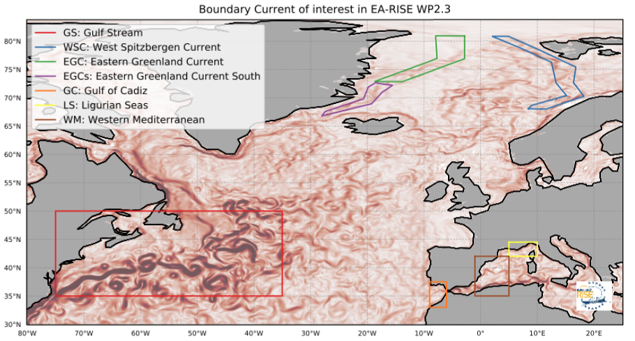

.. currentmodule:: virtualargofleet

Euro-Argo RISE project
======================

.. image:: https://github.com/euroargodev/euroargodev.github.io/raw/master/img/logo/logo-Euro-Argo-Rise_CMYK.png
    :align: center
    :width: 30 %

**VirtualFleet** was created by the `Euro-Argo RISE project <https://www.euro-argo.eu/EU-Projects/Euro-Argo-RISE-2019-2022>`_ in order to provide information for an improved design of the Argo array in the boundary regions of interest to the partners represented in :numref:`figure %s <earise-interest>` below:

.. _earise-interest:

    Boundary current of interest in EA-RISE WP2.3

All results were described in the supplement_ for D2.3_. For the most recent version of the document, please check the `project list of deliverables <https://www.euro-argo.eu/EU-Projects/Euro-Argo-RISE-2019-2022/Deliverables>`_.

This supplement document includes recommendations for the boundary current of interest based on trajectories of virtual argo floats performed with the **VirtualFleet** software.

.. _earise-gs:

Gulf Stream Extension
---------------------
All results are published on this *public* repository: https://github.com/euroargodev/VirtualFleet_GulfStream

**VirtualFleet** was used to:

- reproduce the observed North Atlantic Argo sampling over the 2008-2018 period (this was done to validate the velocity field),
- simulate the 2008-2018 period sampling in the case where floats entering the Gulf Stream Extension region saw their mission parameters temporarily modified until they would exit the region.
We then compared the 11 years simulation difference in profile density computed on a 1x1 degree grid.

Results are shown :numref:`figure %s <earise-gulfstream>` for experiments where the cycling frequency was increased to 5 days and drifting depths changed to: 500, 1000, and 1500 db:

.. _earise-gulfstream:

.. figure:: https://raw.githubusercontent.com/euroargodev/VirtualFleet_GulfStream/main/img/synthesis.png
    :align: center
    :width: 100 %

    Synthesis of Gulf Stream VirtualFleet experiments

We see that if floats drift at 500db, they are taken by the GS out of the box, downstream/eastward, too fast. The result is that the upstream region is now less sampled, to the benefit of the eastern part of the box and outside of it. This is not the expected outcome. On the other hand, if floats drift at 1500db, they are taken by the southward flowing under current. The result is a better sampling of the GS along the U.S. east coast but a rather in-homogeneous increase over the GSE box. Keeping the drifting depth to 1000db seems the best solution in the case where the cycling frequency is increased to 5 days. This set-up leads to an homogeneous increase of the profiles density in the GSE box and a smaller impact on the downstream/eastward sampling decrease.

Nordic Seas
-----------
All results are published on this *private* repository: https://github.com/euroargodev/VirtualFleet_NordicSeas

**VirtualFleet** was used to:

- determine trajectories of Argo floats deployed along the IO-PAN Arex (Poland) Cruises and IMR cruises (Norway) for many possible mission parameters, with the goal of optimizing a trajectory score based on trajectory length, residence time and covered latitude range in the area of interest. This was determined using the an `optimal approach developed at IPMA <https://github.com/euroargodev/VirtualFleet_Optimization>`_.
- simulate a large number of virtual floats using velocity fields from different years (2010-2019) and different combinations of cycle length (3, 5, 7 and 10 days) and parking positions (250, 350, 500, 750, 1000 and 1250 db).

Gulf of Cadiz
-------------
All results are published on this *private* repository: https://github.com/euroargodev/VirtualFleet_Optimization

**VirtualFleet** was used to:

- to simulate and find the best Argo float configuration to maximise the resident time of each float deployed in the Gulf of Cadiz (GoC) region.

Western Mediterranean and Ligurian Sea
--------------------------------------
All results are published on this *private* repository: https://github.com/euroargodev/VirtualFleet_WMed

**VirtualFleet** was used to:

- determine trajectories of Argo floats deployed in small regions inside or outside the BCs for many possible mission parameters, with the goal of determining the best deployment location and parameters to sample the area of interest (using profile density maps).

References
----------

.. [D2.3] Maze, Guillaume, Allen, John, Díaz, Lara, Klein, Birgit, Ruiz-Parrado, Inmaculada, Santos, Miguel, Walczowski, Waldemar, Balem, Kevin, Angel-Benavides, Ingrid, Tintoré, Joaquín, & Taillandier, Vincent. (2022). D2.3: A European strategy plan with regard to the Argo extension in WBC and other boundary regions. Zenodo. https://doi.org/10.5281/zenodo.7362265

.. [supplement] Ingrid M. Angel Benavides, Guillaume Maze, Lara Díaz-Barroso, A. Miguel Santos, Céline van Migerode, Birgit Klein, Matthieu LeJeune. (2023). Supplement to D2.3: A European Strategy plan with regard to the Argo extension in WBC and other boundary regions. https://www.euro-argo.eu/content/download/165178/file/D2.3Supplement_BCStrategy.pdf