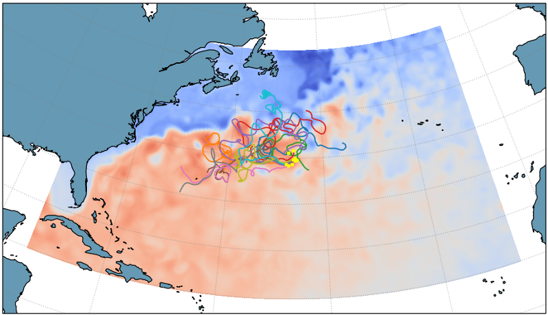
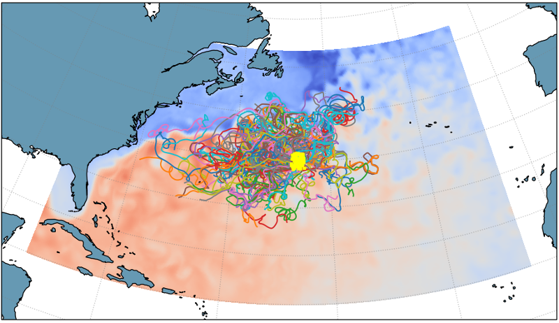
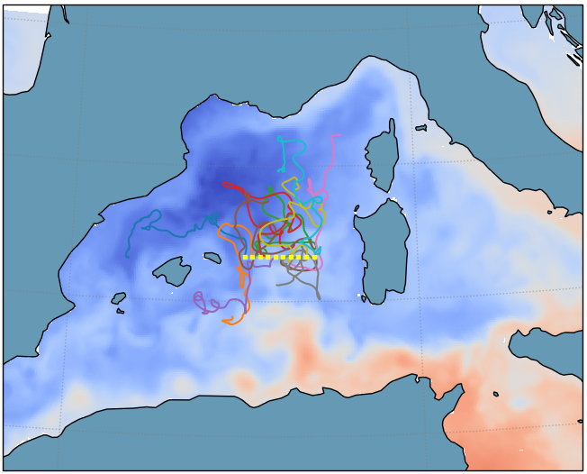
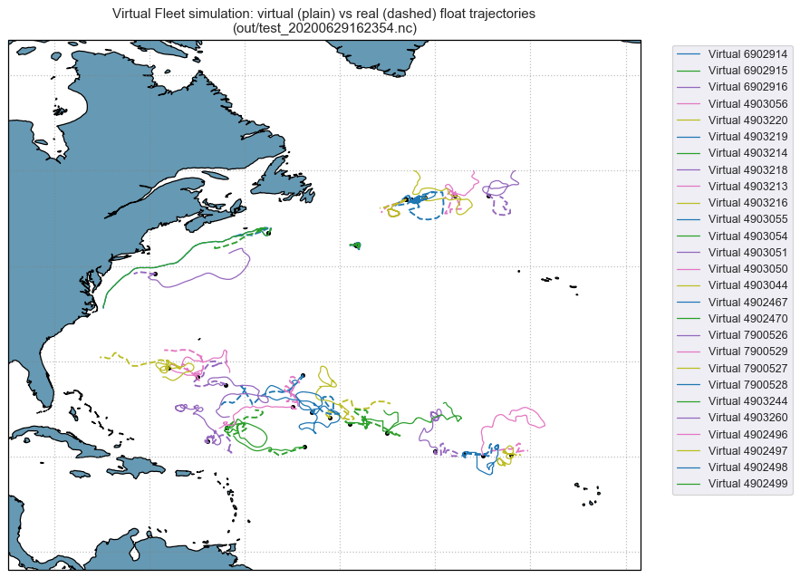
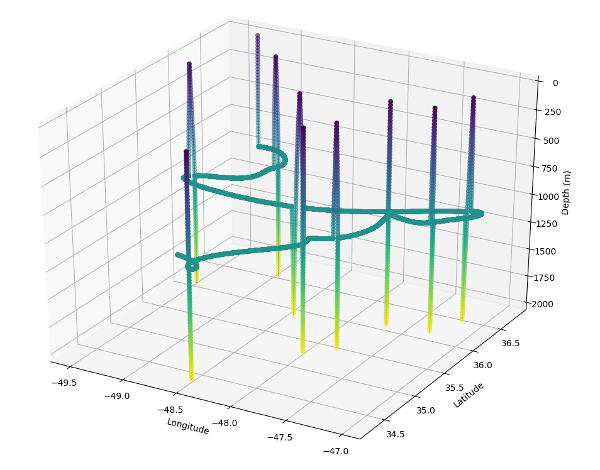

.. currentmodule:: virtualargofleet

Miscellaneous
=============

.. contents::
   :local:

Gulf Stream, Example 1
----------------------
10 floats advected (initial positions in yellow dots) for 1 years, dt = 5 minutes.

**Dataset** :
- GulfStream subset of the Operational Mercator daily ocean analysis and forecast system at 1/12 degree.

**Run** :
- 2 cores in use
- 36 Gb of memory in use
- Runtime = 00:05:30

Gulf Stream, Example 2
----------------------
100 floats advected for 1 year, dt = 5 minutes

**Dataset**  : GulfStream subset of the Operational Mercator daily ocean analysis and forecast system at 1/12 degree.

**Run** :
- 12 cores in use
- 38 Gb of memory in use
- Runtime = 00:05:42

Mediterranean Sea
-----------------
10 floats advected for 1 year, dt = 5 minutes

**Dataset** : Daily Mediterranean MFS - EAS4 of CMCC, at 1/24 degree.

**Run** :
- 3 cores in use
- 186 Gb of memory in use
- Runtime = 00:41:29

Real vs virtual floats comparison
---------------------------------

Simulation of floats deployed in 2019 near Bermuda (plain lines are the virtual floats, dashed lines the real ones). Using the Virtual Fleet software, we do not expect every single virtual float trajectories to be similar to the real ones, but we rather expect a long term regional sampling consistent with reality. Sampling metrics are being developped to assess that automatically with the software.

3D float cycle representation
-----------------------------

