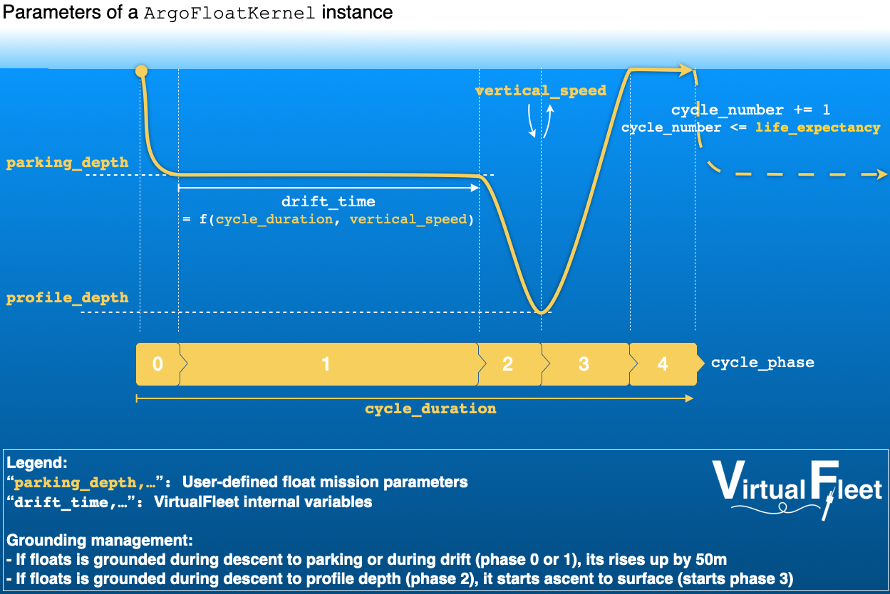

.. currentmodule:: virtualargofleet

Introduction
============

The optimisation of the Argo array is quite complex to determine in specific regions, where the local ocean dynamic shifts away from *standard* large scale open ocean. These regions are typically the Boundary Currents where turbulence is more significant than anywhere else, and Polar regions where floats can temporarily evolve under sea-ice. Furthermore, with the development of Argo float recovery initiatives, it becomes more crucial than ever to be able to predict float trajectories with mission parameters that can be modified on-demand remotely.

**VirtualFleet** aims to help the Argo program to optimise floats deployment and programming.

To do so, the **VirtualFleet** software provides a user-friendly, high-level, collection of Python modules and
functions to make it easy to simulate :ref:`Argo floats <what_is_argo>`.

The general principle is to customise the behavior of particles in a `Lagrangian simulation framework <https://oceanparcels.org>`_ (OceanParcels2019_) using output from ocean circulation models.

Simulated cycle
---------------

Although a virtual Argo float is not as complex as a real one, it simulates the typical Argo float cycle with the most important phases:

- descent to a a predefined parking depth (phase 0),
- free drifting phase at this predefined parking depth (phase 1),
- descent to a predefined profiling depth followed by an ascent to surface (phase 2-3),
- a free drift at the surface to mimic time for geo-positioning and satellite data transmission (phase 4).

This cycle and the simplified associated mission parameters are illustrated :numref:`figure %s <cycle-schematic>`.

.. _cycle-schematic:

    Schematic of an Argo float cycle in VirtualFleet

Components
----------

.. currentmodule:: virtualargofleet.app_parcels

In the VirtualFleet software:

* a virtual float is represented by an :class:`ArgoParticle` instance,
* a virtual float cycle is encoded by an :meth:`ArgoFloatKernel` function,

.. currentmodule:: virtualargofleet

Furthermore:

* a :class:`VirtualFleet` instance represents a fleet of virtual floats, including a deployment plan and the ocean velocity field to transport floats,
* one use a :class:`VirtualFleet` instance to execute a simulation.

The 3 technical requirements to be able to simulate a virtual fleet are the following:

#.  :ref:`a deployment plan <preparation_deployment>`,
#.  :ref:`a velocity field <preparation_velocity>`,
#.  and :ref:`a virtual float mission configuration <preparation_cfg>`.

You will find all details about these requirements, together with the VirtualFleet software helpers to fulfill them in the ":ref:`preparation`" section.

Executing a simulation is explained in the ":ref:`execution`" section and ":ref:`analysis`" get you started with the analysis of the results.

References
----------

.. [OceanParcels2019] The Parcels v2.0 Lagrangian framework: new field interpolation schemes. Delandmeter, P and E van Sebille (2019), Geoscientific Model Development, 12, 3571–3584
